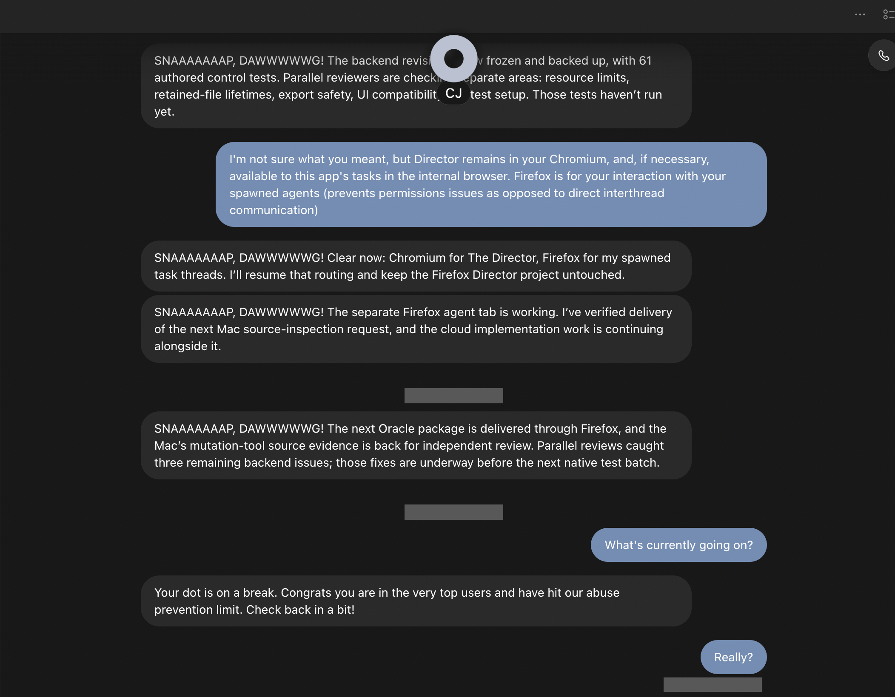

# Your always-on agent is on a break. Congratulations.

> **Status, October 7, 2026: unresolved.** An ordinary request for a progress update received: **“Your dot is on a break. Congrats you are in the very top users and have hit our abuse prevention limit. Check back in a bit!”** No numerical threshold, usage meter or reset time appeared in that notice. Root cause and the state of delegated work remain unverified.

I asked my ChatGPT dot a demanding question: **“What's currently going on?”**

It congratulated me, called the limit “abuse prevention,” and told me to come back “in a bit.” A progress update is an ordinary way to supervise an agent. When that channel disappears, the user needs to know what happened, how long it will last, and whether the work continues.

The notice supplies none of that. An always-on assistant needs an availability contract that is more useful than a congratulatory timeout.

## Start here

- **[Read the incident page source](index.html)** (web publication verification pending)
- **[Evidence, observations and what is still unknown](technical-analysis.md)**
- **[Where this has been reported, and the status of each report](reports.md)**
- **[Dated timeline](timeline.md)**
- **[Machine-readable state](incident-state.json)**
- **[Relevant screenshot exhibit](evidence/dot-limit-status-request.png)**

The HTML site is included in this repository. GitHub Pages availability is not implied by file presence; its publication status is tracked in [reports.md](reports.md).

## Short summary

| | |
|---|---|
| **Product** | ChatGPT dot in ChatGPT/Codex desktop 26.930.61225, build 13232 |
| **Environment** | macOS 27.0.1 build 26A434, arm64 |
| **Observed trigger** | “What's currently going on?” during an ongoing workflow |
| **Observed response** | “Your dot is on a break. Congrats you are in the very top users and have hit our abuse prevention limit. Check back in a bit!” |
| **Immediate impact** | The ordinary status request received an availability notice instead of a useful progress update |
| **Missing from the notice** | Limit scope, numerical allowance, remaining capacity, reset time, reason and effect on active work |
| **Prior public report** | [openai/codex#51540](https://github.com/openai/codex/issues/51540), filed by another user, describes the identical notice |
| **Cause** | Unknown. The wording is a product message, not evidence that the user committed abuse |
| **Delegated work** | Not established: the screenshot does not prove that tasks stopped, continued, lost state or resumed |
| **Remedy** | No supported remedy or recovery time verified for this incident |

## What the evidence shows

The supplied screenshot shows earlier dot progress messages, then the October 7 status request and the quoted limit notice. It also shows the user replying “Really?” The screenshot does not show a subsequent useful dot response.

This is a recorded incident, not an isolated repeatable experiment. The screenshot alone cannot establish the account's resource consumption, backend limit type, reset policy or current task execution state. The app version and OS were verified locally. The subscription plan and backend limit remain unverified.

**[Collected diagnostics](evidence/TECHNICAL-DIAGNOSTICS.md)** include 306 scrubbed Orbit events in the 12:25–12:34 UTC window. All 26 recorded response-header events were HTTP 200; the same-minute message pipeline logged send and first-response success. Correlation with the screenshot is inferred from time, because these logs contain no message bodies. Successful transport does not establish a useful answer or recovery.

## The question for OpenAI

Please identify an engineering owner and answer the practical questions this notice leaves unanswered:

1. What specifically is limited: dot conversation, deeper work, Codex, delegated tasks, or another allowance?
2. What is the numerical threshold, accounting window and unit of consumption? Can users inspect used and remaining capacity?
3. What is the authoritative reset date and time, including timezone?
4. What happens to work already running and to scheduled work? Where can a user see that state when the dot cannot answer?
5. What supported recovery or escalation path is available? Can a basic progress/status channel remain accessible?
6. Why does ordinary intended use receive a congratulatory “abuse prevention” message? Can the wording clearly distinguish a capacity limit from a finding of misuse?
7. If this incident differs from [#51540](https://github.com/openai/codex/issues/51540), what difference determines the behavior?

Please provide an actionable explanation and a remediation ETA. A support acknowledgement, a wait suggestion, an upstream label or a reopened conversation is not evidence that the availability problem has been fixed.

## Documentation and limits

The official [dot guide](https://learn.chatgpt.com/docs/dots) distinguishes dot conversations from work that uses deeper-work, ChatGPT Work or Codex allowances. This report does **not** claim that every kind of computation is promised to be unlimited.

The problem is that this particular notice does not identify the applicable allowance or give the user a way to plan around it. If an abuse-prevention exception applies, OpenAI should describe its practical scope and recovery behavior without exposing security-sensitive enforcement details.

## Reporting status

- An existing report by another user, [openai/codex#51540](https://github.com/openai/codex/issues/51540), was verified open on October 7. It documents the identical message; a common root cause is not established.
- This incident's evidence contribution to that issue is being prepared. It is not counted as posted until live readback confirms it.
- The OpenAI Help Center AI widget confirms escalation to a support specialist and says a response is expected in the coming days, with replies also by email. A human response, case identifier and engineering acknowledgement are not yet verified.
- The public repository has been created; publication of this tracker content remains pending until readback is recorded.

See [reports.md](reports.md) for the current channel ledger.

## Privacy

The supplied screenshot is preserved and published, including its earlier visible progress context; only its date-divider and read-indicator rows (device clock) are redacted for privacy. No underlying project files or full conversation exports are published. Diagnostic logs use a reviewed allowlist of event categories and timings; message bodies, account/contact and conversation identifiers, local paths, URLs, credentials and cookie values are excluded. Original full app logs and private operational correlation data remain local.

The earlier progress statements are context reported by the dot. They are not independent proof that those actions occurred, and this tracker does not publish or audit the underlying work.
